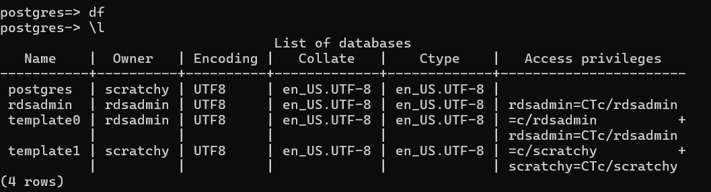

# Terraform Configuration for VPC, RDS, EC2

## How to Use

1. Create S3 Bucket(for Terraform Backend) and DynamoDb table (For terraform Backend State locking)
   eg. may use aws cli commands

```
#create S3 Bucket
S3_BUCKET_NAME="<name>"
aws s3 mb "s3://$S3_BUCKET_NAME" --region "us-east-1"

# create dynamoDB table
aws dynamodb create-table \
  --table-name "tf-lock-table" \
  --attribute-definitions AttributeName=LockID,AttributeType=S \
  --key-schema AttributeName=LockID,KeyType=HASH \
  --provisioned-throughput ReadCapacityUnits=1,WriteCapacityUnits=1 \
  --region "us-east-1"
```

2. Initialize Terraform

```
terrafrom init
```

3.  Run Terraform Plan to view what resources are going to get created

```
terrafrom plan
```

4. Run terraform Apply (with or without --auto-approve)
```
terrafrom apply
or 
# to avoid prompt for approval
terraform apply --auto-approve
```
5. You  have to provide the RDS db password on the console or via environment variable 
6. Note the rds enpoint and public ip of ec2 instance 
7. You can SSH to the ec2 instance to test DB connection from there.
```
#ssh command example
ssh -i "ec2-keypair.pem" ec2-user@ec2-54-167-75-154.compute-1.amazonaws.com
ssh -i "ec2-keypair.pem" ec2-user@<publicip>

#test connection to rds
#install required packages
sudo amazon-linux-extras install -y postgresql14

#run the below command to connect and see available databases 
sudo psql --host=postgres-db.c7u0qwceyrzs.us-east-1.rds.amazonaws.com --port=5432 --username=scratchy --password --dbname=postgres
```
8. Verify the databases 
